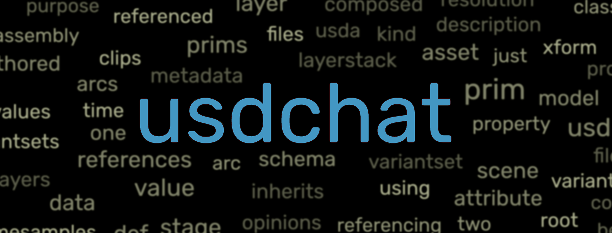
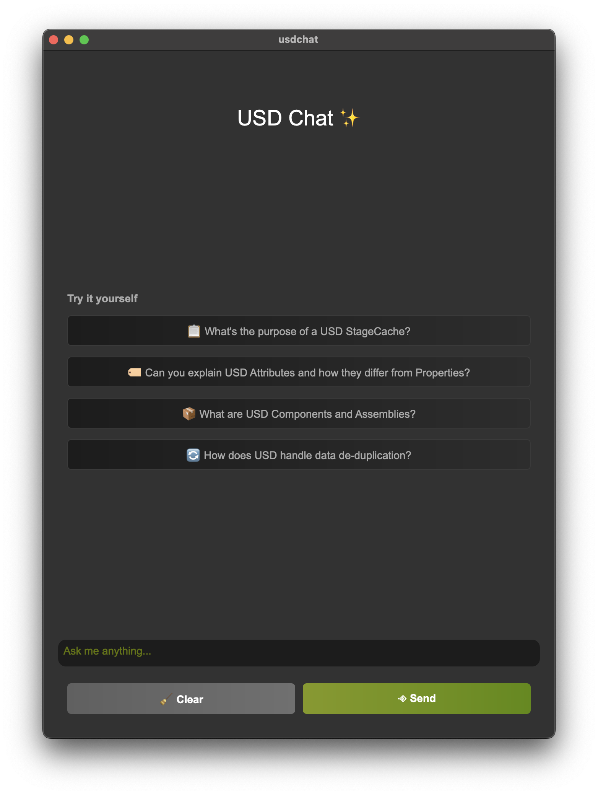
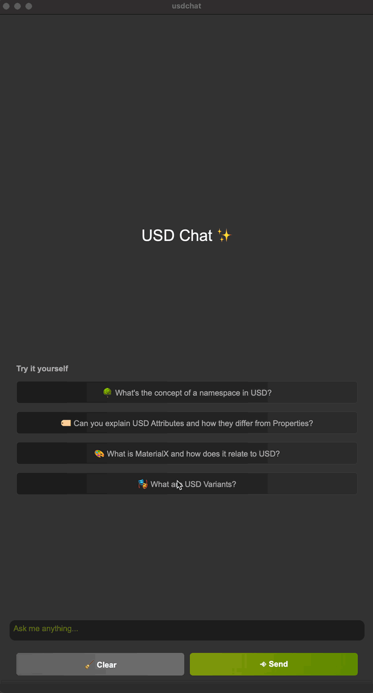
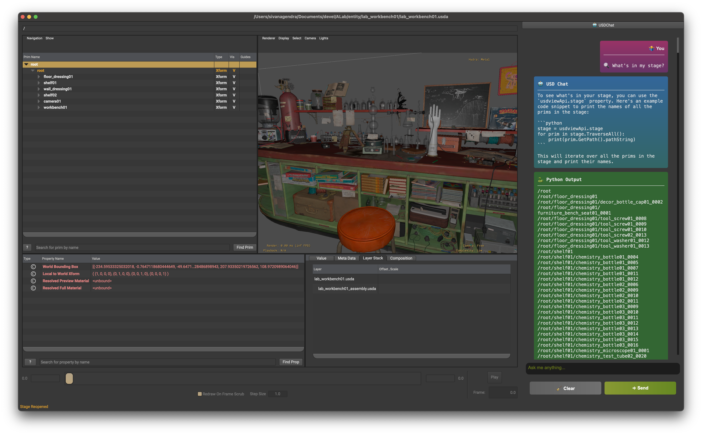
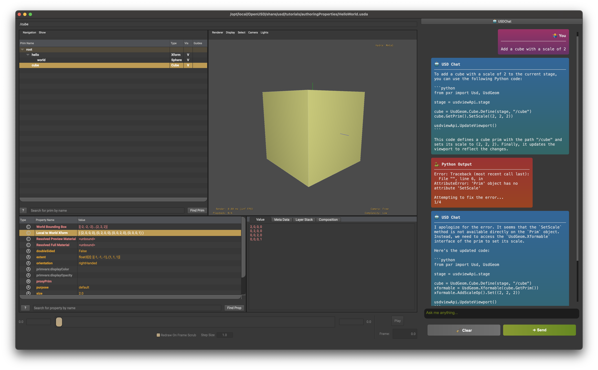

# 🤖 usdchat - Your Ultimate USD Sidekick 🌟

Unlock the power of **Universal Scene Description (USD)** through natural language with **usdchat**! With the brains of OpenAI's large language models and seamless integration into your favorite USD authoring tools, this isn't just a chatbot—it's your next-level USD assistant. 🚀



## 🌈 What Can It Do?

✨ [Watch this YouTube video to see 🤖 usdchat in Action!](https://youtu.be/Tm7_IZxPrMI) ✨

[](https://www.youtube.com/watch?v=Tm7_IZxPrMI)

## 🤷‍♂️ What Can't It Do?
Actually, a lot 🤣 It's a fun and experimental project and not meant to be taken seriously, yet.

This is a work in progress, and we're just getting started. But here's what it can do right now:

## 🎨 usdchat Standalone

Imagine having a chat with GPT models that actually *get* OpenUSD and computer graphics. Ever been stuck wondering, *"What's the deal with namespaces in USD?"* 🤷‍♂️ Wonder no more!

<table>
    <tr>
        <td></td>
        <td></td>
    </tr>
</table>

## 🛠 usdchat Plugin

Take it up a notch with our plugin designed to live inside your go-to USD authoring tools, starting with [usdview](https://github.com/PixarAnimationStudios/OpenUSD/blob/release/pxr/usdImaging/bin/usdview/usdview.py).

### 🐍 Python Code Execution

Not just a pretty chat interface! The `usdview_chat` plugin also runs Python code generated by GPT in a separate thread. You get to see the results right in the chat window, decked out in green!



### 🛡 Auto Error Correction

Let's face it, even GPT isn't perfect. Our inbuilt error handling kicks in, sending the hiccup back to the GPT model for a smarter response. This is low-key genius for generating more reliable USD code. 🧠



- Any failed Python code execution is flagged and displayed in red 🚨, because we believe in second chances.

- After `MAX_ATTEMPTS`, it'll tap out and show the error message.

## 💬 Conversation History

Your chat history isn't just stored; it's used for context in future conversations. It's like your chatbot learns from you! 🤓

- 🧹 Hitting the "Clear" button wipes the slate clean for a fresh conversation.
- Reboot the chat window, and you're starting a new conversation.

## 🚀 How to Use?

1. Clone this masterpiece:
    ```bash
    git clone https://github.com/siva-nagendra/usdchat
    ```
2. Get those dependencies:
    ```bash
    pip install -r requirements.txt
    ```
3. Launch it, standalone style:
    ```bash
    python main.py
    ```

- For the plugin, you'll need `usdview`. Check how to get it [here](https://github.com/siva-nagendra/usdchat).
- Set some environment magic:
    ```bash
    export PYTHONPATH=$PYTHONPATH:/path/to/usdchat
    export PXR_PLUGINPATH_NAME=$PXR_PLUGINPATH_NAME:/path/to/usdchat/plugins/usdview_chat
    ```
- Don't forget the OpenAI API key, the secret sauce 🤫:
    ```bash
    export OPENAI_API_KEY=<your openai api key>
    ```
- And you're set! Launch `usdview` and watch `🤖 usdchat` come to life. 🎉

## 💡 How to Make It Even Better?

- Considering the introduction of [embeddings](https://platform.openai.com/docs/guides/embeddings) to refine the model's understanding.
- Fine-tuning with USD-specific data is definitely on the cards.
- Enabling Google search for background checks on responses. Yes, it's slower, but hey, quality takes time. 🕰
- Open-source models like [Llama2](https://ai.meta.com/llama/) are improving day by day, but OpenAI is still the OG.
- Got ideas? Spill! I'm all ears. 🙌

## 🛠 Tech Stack

- Front-end: PySide6 (Because we like things pretty 😎)
- Back-end: Python (The backbone!)
- AI Model: OpenAI GPT-4/GPT-3.5-turbo (The brain 🧠)
- Others: Pixar's OpenUSD, and magic! ✨

## 🤝 Contribute

Got code? Send in a Pull Request! Let's make this even more awesome together. 🤜🤛

## 📜 License

MIT License, because we like to share. Check out the [LICENSE](LICENSE) for deets.

## 💌 Contact

Crafted with ❤️ by Siva. Slide into my DMs anytime! 📩