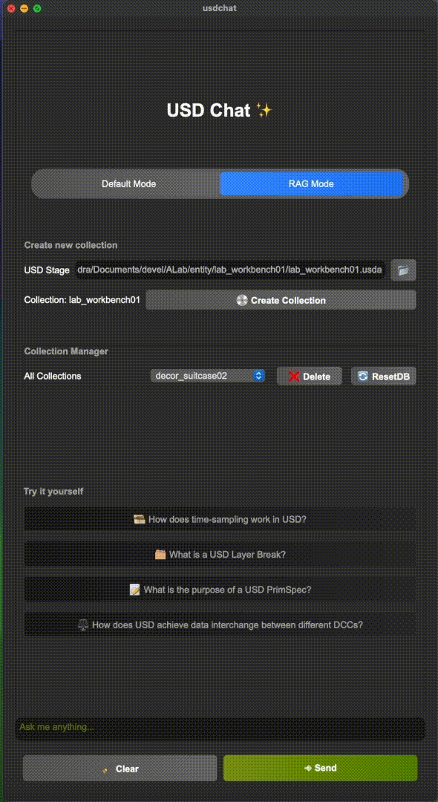

# 🤖 usdchat - Your Ultimate USD Sidekick 🌟

usdchat is a conversational bot that lets you interact with USD Stage using natural language. Powered by OpenAI large language models, this AI assistant can answer you basic USD queries as well as a plugin to your favorite USD authoring toolsets. 🚀


## 🌈 What Can It Do?

✨ Watch these YouTube videos to see 🤖 usdchat in Action! ✨
[](https://youtu.be/9G0QUs5uoBg)

[](https://www.youtube.com/watch?v=Tm7_IZxPrMI)
https://youtu.be/9G0QUs5uoBg

## 🤷‍♂️ What Can't It Do?
Actually, a lot 🤣 It's a fun and experimental project and not meant to be taken seriously, yet.

This is a work in progress, and we're just getting started. But here's what it can do right now:

## 🎨 usdchat Standalone

Imagine having a chat with GPT models that actually *get* OpenUSD and computer graphics. Ever been stuck wondering, *"What's the deal with namespaces in USD?"* 🤷‍♂️ Wonder no more!


## 🛠 usdchat Plugin

Take it up a notch with our plugin designed to live inside your go-to USD authoring tools, starting with [usdview](https://github.com/PixarAnimationStudios/OpenUSD/blob/release/pxr/usdImaging/bin/usdview/usdview.py).

### 🐍 Python Code Execution

Not just a pretty chat interface! The `usdview_chat` plugin also runs Python code generated by GPT in a separate thread. You get to see the results right in the chat window, decked out in green!


### 🛡 Auto Error Correction

Let's face it, even GPT isn't perfect. Our inbuilt error handling kicks in, sending the hiccup back to the GPT model for a smarter response. This is low-key genius for generating more reliable USD code. 🧠


- Any failed Python code execution is flagged and displayed in red 🚨, because we believe in second chances.

- After `MAX_ATTEMPTS`, it'll tap out and show the error message.

## 💬 Conversation History

Your chat history isn't just stored; it's used for context in future conversations. It's like your chatbot learns from you! 🤓

- 🧹 Hitting the "Clear" button wipes the slate clean for a fresh conversation.
- Reboot the chat window, and you're starting a new conversation.

## 🎇 Diving Deeper with Vector Embeddings and ChromaDB 🌌

One of the exciting extensions in usdchat is its integration with ChromaDB for handling vector embeddings of USD stage files. This feature enriches the understanding of the scene by our large language models. 

### 🌀 What are Vector Embeddings?

Vector embeddings are a way to convert textual or other forms of data into vectors of real numbers which can then be processed efficiently. This method is fundamental in various Natural Language Processing tasks. In the realm of usdchat, vector embeddings grant a deeper insight into the composition of the USD stage, allowing the large language models to fathom the scene from the inside out. For a deeper dive into vector embeddings, check out this [explanation](https://towardsdatascience.com/word-embeddings-explained-c07c5ea44d64).

### 📚 A Glimpse at ChromaDB

ChromaDB is an open-source vector database that facilitates the storage and management of vector embeddings. It's not only loved by the community but also utilized in notable projects like Microsoft's Autogen. Have a peek at [ChromaDB](https://www.trychroma.com/) to delve into its capabilities.

### 🛠 Implementing ChromaDB in usdchat

usdchat employs ChromaDB to locally store the vector embeddings of USD stage files. The process initiates by resolving the USD stage to uncover all dependencies. It then converts any binary files to ASCII, compressing the long lines of text in our usdGeoms. These processed files are now ripe for embedding into the vector database.



This approach to embeddings in usdchat is off the beaten path. By creating, querying, deleting, updating, and resetting the ChromaDB collections, managing different embeddings becomes a breeze. This is especially pivotal in the new Retrieval Augmented Generation (RAG) mode where collections are at the heart of managing various embeddings. Check out more on [ChromaDB collections](https://docs.trychroma.com/usage-guide#using-collections).

### 📊 Making Sense of the Scene

With the help of ChromaDB, usdchat now has a firmer grasp of the scene's structure and content. The Python code runner agent, coupled with the vector embeddings, forms a more rounded understanding, analyzing the scene from both outside and inside.


## 🚀 How to Use?

1. Clone this masterpiece:
    ```bash
    git clone https://github.com/siva-nagendra/usdchat
    ```
2. Get those dependencies:
    ```bash
    pip install -r requirements.txt
    ```
3. Launch it, standalone style:
    ```bash
    python main.py
    ```

- For the plugin, you'll need `usdview`. Check how to get it [here](https://github.com/siva-nagendra/usdchat).
- Set some environment magic:
    ```bash
    export PYTHONPATH=$PYTHONPATH:/path/to/usdchat:/path/to/usdchat/plugins
    export PXR_PLUGINPATH_NAME=$PXR_PLUGINPATH_NAME:/path/to/usdchat/plugins/usdview_chat
    ```
- Don't forget the OpenAI API key, the secret sauce 🤫:
    ```bash
    export OPENAI_API_KEY=<your openai api key>
    ```
- And you're set! Launch `usdview` and watch `🤖 usdchat` come to life. 🎉

## 💡 How to Make It Even Better?

- Considering the introduction of [embeddings](https://platform.openai.com/docs/guides/embeddings) to refine the model's understanding.
- Fine-tuning with USD-specific data is definitely on the cards.
- Enabling Google search for background checks on responses. Yes, it's slower, but hey, quality takes time. 🕰
- Open-source models like [Llama2](https://ai.meta.com/llama/) are improving day by day, but OpenAI is still the OG.
- Got ideas? Spill! I'm all ears. 🙌

## 🛠 Tech Stack

- Front-end: PySide6 (Because we like things pretty 😎)
- Back-end: Python (The backbone!)
- AI Model: OpenAI GPT-4/GPT-3.5-turbo (The brain 🧠)
- To keep a tab on the token count, usdchat has also embraced `tiktoken` (The token counter 🔄)
- Others: Pixar's OpenUSD, and magic! ✨


### 🔄 The Continuous Loop

The journey doesn't stop here. The goal is to continue refining, testing, and expanding the capabilities of usdchat, with vector embeddings and ChromaDB being a significant stride in that direction.

## 🤝 Contribute

Got code? Send in a Pull Request! Let's make this even more awesome together. 🤜🤛

## 📜 License

MIT License, because we like to share. Check out the [LICENSE](LICENSE) for deets.

## 💌 Contact

Crafted with ❤️ by Siva. Slide into my DMs anytime! 📩